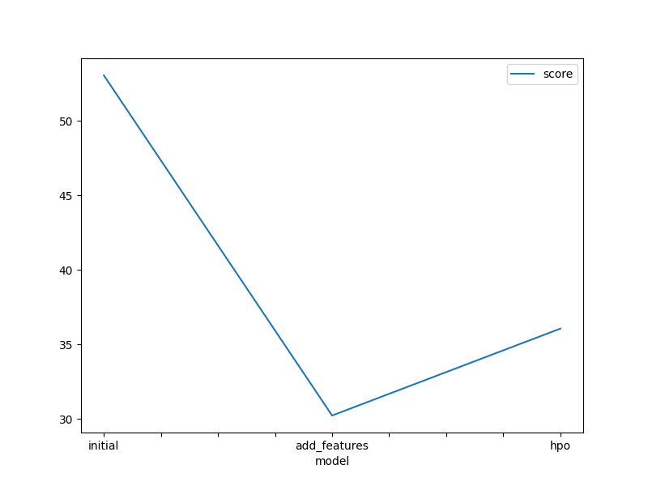
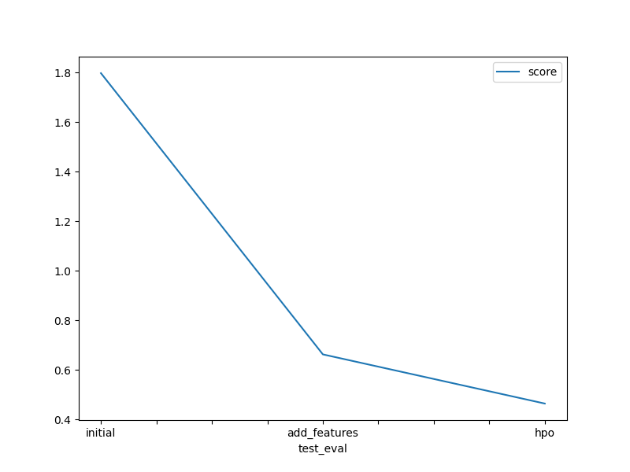

# Report: Predict Bike Sharing Demand with AutoGluon Solution
#### Marwa Ahmad

## Initial Training
### What did you realize when you tried to submit your predictions? What changes were needed to the output of the predictor to submit your results?
TODO: An error occurred while committing kernel: The kernel source must be less than 1 megabytes in size.

### What was the top ranked model that performed?
TODO: WeightedEnsemble_L3

## Exploratory data analysis and feature creation
### What did the exploratory analysis find and how did you add additional features?
TODO: 
 which made preprocessing easier. I observed meaningful relationships between certain features, such as between atemp (feels-like temperature) and humidity, indicating potential correlations that could impact model performance.

Some columns required transformation—for example, datetime fields needed to be broken down, and certain numerical columns were better represented as categorical variables.

I created additional features extracted from the datetime column, such as day, hour, month, and year, to capture temporal patterns more effectively. I also converted some numerical columns into categorical types based on their distribution. Furthermore, I engineered new features like averages and sums to enrich the dataset with more informative attributes.

### How much better did your model preform after adding additional features and why do you think that is?
TODO: 
After adding the new features—such as hour, day, month, and year extracted from the datetime column, as well as converting numerical columns to categorical and calculating aggregated statistics—the model's performance improved significantly.

Specifically, the root mean squared error (RMSE) decreased from 1.79709 to 0.66298, which indicates a substantial increase in prediction accuracy.

I believe this improvement happened because the new features provided the model with more informative and structured data, especially temporal patterns and categorical distinctions that were not captured in the original dataset. This allowed the model to better understand the relationships in the data and make more accurate predictions.

## Hyper parameter tuning
### How much better did your model preform after trying different hyper parameters?
TODO: After tuning the hyperparameters, the model's performance improved significantly. The root mean squared error (RMSE) decreased from 0.66298 to 0.46465, which indicates a notable increase in prediction accuracy.

### If you were given more time with this dataset, where do you think you would spend more time?
TODO: If I had more time to work on this dataset, I would focus more on hyperparameter tuning and further exploratory data analysis (EDA).
Fine-tuning hyperparameters in more depth could lead to better model performance, and deeper EDA might help uncover additional insights or hidden patterns that could be used to create new, more informative features

### Create a table with the models you ran, the hyperparameters modified, and the kaggle score.
|model|hpo1(learning_rate)|hpo2(num_epochs)|hpo3(activation)|score(RMSE)|
|--|--|--|--|--|
|initial|default|default|default|1.79709|
|add_features|default|default|default|0.66298|
|hpo|0.005|15|relu|0.46465|

### Create a line plot showing the top model score for the three (or more) training runs during the project.

TODO: Replace the image below with your own.

### Create a line plot showing the top kaggle score for the three (or more) prediction submissions during the project.

TODO: Replace the image below with your own.

## Summary
TODO: 
These results demonstrate the importance of both feature engineering and proper model tuning in building high-performance machine learning solutions.
